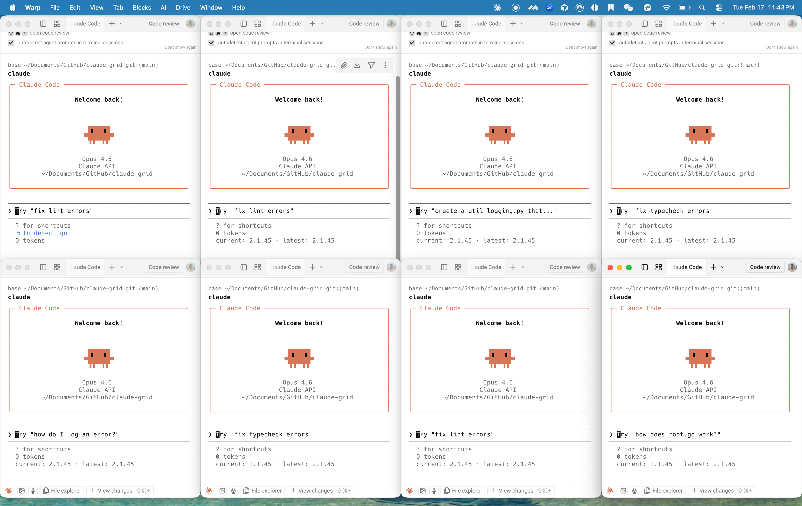

# claude-grid

> Spawn and tile multiple Claude Code instances in a grid layout with a single command.



## Features

- 🚀 **One-command launch**: `claude-grid 4` spawns 4 tiled terminal windows
- 🗂️ **Multi-repo orchestration**: Each window in a different repo with its own prompt
- 📋 **Manifest files**: Define complex multi-repo sprints in a single YAML file
- 📐 **Auto-calculated grid layouts**: 1→1×1, 2→1×2, 4→2×2, 9→3×3, etc.
- 🖥️ **Multiple terminal backends**: Terminal.app (built-in) and Warp
- 💾 **Session tracking**: List and kill sessions with `list` and `kill` commands
- 🎯 **Smart screen detection**: Automatically accounts for menu bar and Dock
- ⚡ **Zero configuration**: Works out of the box

## Installation

### Homebrew (recommended)

```bash
brew install riricardoMa/tap/claude-grid
```

### Go Install

```bash
go install github.com/riricardoMa/claude-grid@latest
```

### From Source

```bash
git clone https://github.com/riricardoMa/claude-grid.git
cd claude-grid
make install
```

## Requirements

- **macOS** 12+ (darwin)
- **Claude Code CLI**: Install with `npm install -g @anthropic-ai/claude-code`
- **Terminal.app** (built-in) or **Warp** (optional)

## Quick Start

```bash
# Spawn 4 Claude instances in a 2×2 grid
claude-grid 4

# Each window in a different repo — count inferred automatically
claude-grid --dir ~/projects/frontend --dir ~/projects/backend --dir ~/projects/infra

# Per-window prompts paired with directories
claude-grid \
  --dir ~/projects/frontend --prompt "fix the login page CSS" \
  --dir ~/projects/backend  --prompt "add rate limiting to /api/auth" \
  --dir ~/projects/infra    --prompt "update the Terraform modules"

# Load a multi-repo sprint from a manifest file
claude-grid --manifest sprint.yaml

# Use specific terminal backend
claude-grid 2 --terminal warp

# Named session for easy reference
claude-grid 4 --name my-project
```

## Usage

### Spawn Windows

```bash
claude-grid [count] [flags]
```

**Arguments:**
- `[count]` — Number of windows to spawn (1–16). Optional when `--dir` or `--manifest` is provided.

**Flags:**
- `--dir, -d <path>` — Working directory (repeatable; infers count from number of flags)
- `--prompt <text>` — Per-instance prompt sent to Claude (repeatable; paired with `--dir` by index)
- `--manifest, -M <file>` — YAML manifest defining instances (see [Multi-Repo Mode](#multi-repo-mode))
- `--terminal, -t <backend>` — Terminal backend: `terminal` or `warp` (default: auto-detect)
- `--name, -n <name>` — Session name (default: auto-generated as `grid-XXXX`)
- `--layout, -l <RxC>` — Grid layout override, e.g., `2x3` or `3X2` (default: auto-calculated)
- `--verbose` — Enable verbose output

**Examples:**

```bash
# Auto-detected backend, 2×2 grid
claude-grid 4

# Custom layout: 3 rows × 2 columns
claude-grid 6 --layout 3x2

# Warp backend with specific directory
claude-grid 2 --terminal warp --dir ~/code/project

# Named session
claude-grid 3 --name my-dev-session
```

### Multi-Repo Mode

Spawn Claude instances across different repositories in one command — the key workflow for full-stack sprints where frontend, backend, infra, and docs live in separate repos.

#### Repeatable `--dir` and `--prompt`

Pass `--dir` multiple times to open each window in a different directory. The count is inferred automatically — no need for a positional argument.

```bash
# 3 windows, each in a different repo
claude-grid \
  --dir ~/projects/frontend \
  --dir ~/projects/backend \
  --dir ~/projects/infra
```

Pair with `--prompt` (by index) to give each Claude instance a specific task:

```bash
claude-grid \
  --dir ~/projects/frontend --prompt "fix the login page CSS" \
  --dir ~/projects/backend  --prompt "add rate limiting to /api/auth" \
  --dir ~/projects/infra    --prompt "update the Terraform modules"
```

You can also mix an explicit count with a single `--dir` to open N windows all in the same non-cwd directory:

```bash
# 4 windows, all in ~/projects/my-app
claude-grid 4 --dir ~/projects/my-app
```

#### Manifest Files

For repeatable or complex sprint setups, define everything in a YAML manifest and pass it with `--manifest`:

```bash
claude-grid --manifest sprint.yaml
```

**Manifest format** (`sprint.yaml`):

```yaml
name: sprint-42          # optional — used for display

instances:
  - dir: ~/projects/frontend
    prompt: "fix the login page CSS"
    branch: fix/login-css        # optional: checkout this branch before spawning

  - dir: ~/projects/backend-api
    prompt: "add rate limiting to /api/auth"

  - dir: ~/projects/shared-lib
    prompt: "update TypeScript types for new auth flow"

  - dir: ~/projects/docs
    prompt: "update API docs to reflect new auth endpoints"
```

**Fields:**

| Field | Required | Description |
|-------|----------|-------------|
| `dir` | ✅ | Path to the repository. Supports `~` expansion and relative paths (resolved from the manifest file's location). |
| `prompt` | — | Initial prompt sent to Claude in that window. |
| `branch` | — | Git branch to check out before spawning (`git checkout <branch>`). Must already exist — branch creation is not supported. |

**Rules:**
- `--manifest` cannot be combined with `--dir`, `--prompt`, `--worktrees`, or a count argument. Use `--name`, `--layout`, and `--terminal` freely alongside it.
- Maximum 16 instances per manifest.
- All `dir` paths are validated to exist before any window is spawned.

#### Conflict Detection

```bash
# ✅ Valid — orthogonal flags work fine
claude-grid --manifest sprint.yaml --name my-sprint --terminal warp

# ❌ Error — manifest conflicts with explicit dirs
claude-grid --manifest sprint.yaml --dir ~/projects/foo

# ❌ Error — manifest conflicts with count arg
claude-grid --manifest sprint.yaml 4
```

### List Sessions

```bash
claude-grid list
```

Shows all active sessions with:
- Session name
- Backend (terminal or warp)
- Window count
- Working directory
- Creation time
- Stale indicator (if windows no longer exist)

**Example output:**
```
SESSION     BACKEND    WINDOWS  DIR                    CREATED
grid-a3f2   terminal   4        ~/projects/my-app      2026-02-17 10:30
grid-b1c4   warp       2        ~/projects/api         2026-02-17 11:15
```

### Kill Session

```bash
claude-grid kill <session-name>
```

Closes all windows in the session and removes the session file.

**Example:**
```bash
claude-grid kill grid-a3f2
```

### Version

```bash
claude-grid version
```

Shows version, commit, and build date:
```
claude-grid v0.1.0 (darwin/arm64) commit:abc123 built:2026-02-17
```

## Supported Backends

### Terminal.app

- **Availability**: Built-in macOS terminal, always available
- **Method**: Spawns via AppleScript `do script` and tiles via `bounds` property
- **Pros**: No extra installation required, stable, fast

### Warp

- **Availability**: Requires [Warp](https://www.warp.dev) installation
- **Method**: Spawns via `warp://action/new_window` URI scheme, tiles via System Events
- **Pros**: Modern terminal with GPU acceleration, collaborative features
- **Note**: First use requires granting Accessibility permission (see Troubleshooting)

### Auto-Detection

When `--terminal` is not specified, `claude-grid` automatically selects:
1. **Warp** (if `/Applications/Warp.app` exists)
2. **Terminal.app** (fallback)

## Troubleshooting

### `'claude' not found in PATH`

**Error:**
```
'claude' not found in PATH. Install: npm install -g @anthropic-ai/claude-code
```

**Solution:**
Install Claude Code CLI:
```bash
npm install -g @anthropic-ai/claude-code
```

Verify installation:
```bash
which claude
```

### Warp windows not tiling

**Issue**: Windows spawn but don't tile into a grid.

**Cause**: Warp backend uses System Events for window positioning, which requires **Accessibility permission**.

**Solution**:
1. Open **System Settings**
2. Navigate to **Privacy & Security** → **Accessibility**
3. Add your terminal app (e.g., Terminal.app, iTerm2, or the app running `claude-grid`)
4. Grant permission
5. Retry spawning

### Invalid count error

**Error:**
```
invalid count X: must be between 1 and 16
```

**Solution**: Count must be in the range 1-16:
```bash
claude-grid 4   # ✅ Valid
claude-grid 0   # ❌ Invalid (too small)
claude-grid 20  # ❌ Invalid (too large)
```

### Small window warning

**Warning:**
```
warning: small windows detected (400x300 minimum). Readability may be reduced.
```

**Explanation**: High window counts (9+) on smaller screens may result in windows smaller than 400×200 pixels. The command still proceeds, but readability may be reduced.

**Solution**: Use a smaller count or specify a custom layout with fewer rows/columns.

## Session Storage

Sessions are stored as JSON files in `~/.claude-grid/sessions/<name>.json`.

**Session file format:**
```json
{
  "name": "grid-a3f2",
  "backend": "terminal",
  "count": 4,
  "dir": "/Users/bob/projects/my-app",
  "created_at": "2026-02-17T10:30:00Z",
  "windows": [
    {"id": "12345", "index": 0},
    {"id": "12346", "index": 1},
    ...
  ]
}
```

## Development

### Build

```bash
make build
```

Binary output: `bin/claude-grid`

### Test

```bash
make test
```

Runs all unit tests with coverage.

### Pre-commit Check

```bash
make check
```

Runs `go vet`, `go test`, and `go build`.

## License

MIT

---

**Made with ❤️ for the Claude Code community**
